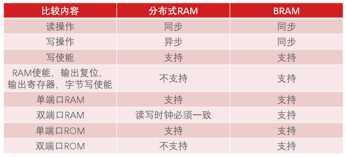
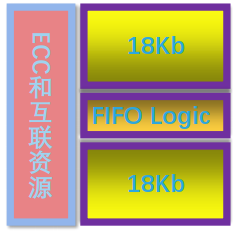
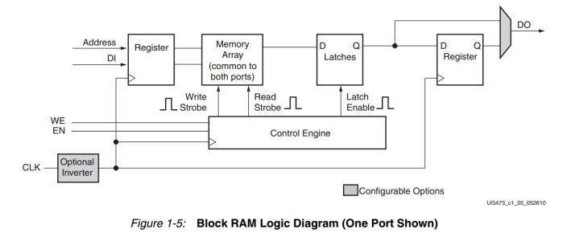
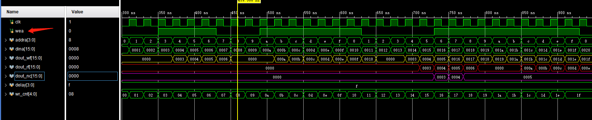

## block ram
ug473 不同厂家的bram有社么区别 bram和分布式ram的优势; xilinx 36kRAM架构的特性
### - 存储资源的意义
32位系统 2^32 4G 
在7series的可以查看其PL部分的total block ram 很少

了解bram的特性可以使用的更加充分

### - FPGA中的存储资源
1. 锁存器 触发器 DFF latch:有记忆功能的逻辑单元
2. 查找表 LUT : 寄存器和查找表可以组合成分布式RAM 
3. block RAM: 在FPGA片上嵌入的存储单元 m36k(7 series)
在FPGA内部的存储模块时由上述三种资源构成的, 分为RAM ROM FIFO, FIFO本身是带逻辑的RAM
block RAM 在片上的布局

#### xilinx 的RAM有两种 
1. distributedRAM 一个clb有8个寄存器 锁存器只有4个.1024位宽的话, 非常消耗资源
2. blockRAM: 内嵌的SRAM, 单位是块
下面进行一个对比

输出寄存器会提升性能
所谓的36kRAM 其实是两个独立的18Kb的ram, 其框架为

可以配置为 单端口 双 真 
最高可以给到 512*72 最宽就是72位, 并且一个72位数据就吃掉了很多bram资源
变换数据位宽, 深度加深, 调整输入输出
由于其架构, 两个18kRAM无法共用FIFO 所以组合上会少 不能生成两个18kFIFO

#### RAMB18E1逻辑
pg058 查看对于ECC的解释

输入会有一个寄存 输出有一个锁存一个寄存 
对于读写同一个地址的时候有三个模式:
读优先 写优先 保持 默认是no change 
在一个RAM读写时序时 对于写入 写使能有效 写入din的数据进入addr端口地址.
在读取时, 直接从dout读出addr地址的数据. 在写使能时 读到的是新数据还是旧数据
取决于RAM的工作模式

谁放在 memory array 谁在latch
- 读优先 消耗更多 BRAM资源的 保证读到先前的数据.输入先放到缓存 并输出先前值 
- 写优先 在读写时钟异步的时候推荐, 保证先写入
保持模式的时候 写操作期间,锁存器保留上次的读,最省电 we=1时
ip:block memory 
设置宽度和深度的时候 深度先写入后读出 留余量
输出位宽 可以不同于输入, 进行位宽变换 

**还是要整个看bramtest这个工程**
在这个工程中，使用一个双端口bram来对三个单端口的不同模式进行写入，查看三种模式的不同表现。通过对三个模块同时写入相同的数据来查看写入模式的影响

使用寄存器的方式 pg058 page27
bram有内置的寄存器 primitives Output Register这个时钟频率比slice中的寄存器要高
这个寄存器的存在使得输出慢了一个拍 同时输入有一个寄存器 则会慢两个拍
这个寄存器可以关闭 输入寄存器不能 最多慢一个拍

输出的寄存器和latch可以直接赋值

初始化bram 可以自定义 输入进制 内容

BRAM写字节
BRAM内核提供了字节写入操作. 8位或九位(带一位奇偶校验).
此时 we变成wea 有几个byte就有几位宽, 分别对应每个byte 

BRAM的级联 真双端口
CASCADEIN CASCADEOUT 实现 这个在ipcore里面没有配置 需要使用原语进行链接 拓展位宽