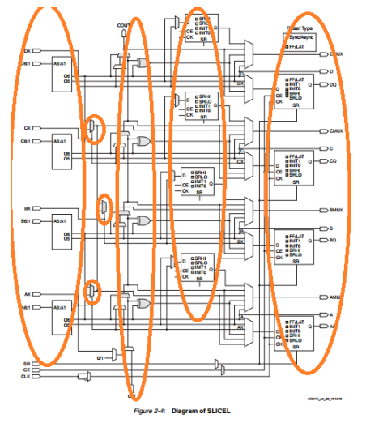
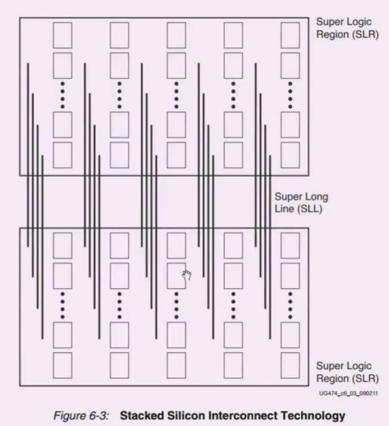

## IOB
IOB本身是非常重要的资源 需要话很多时间看ug471 
和外界交互的器件 但不仅仅是引脚 在xilinx中分为HP 1.8V 高性能接口 高速 HR 3.3v 高动态 广泛的电平标准
HR管脚没有ODEdelay block

ologic 也不同 缺了一个模块
-  1.电器特性: 
    电平标准 
    vcco参考电压
    单端:lvcmos lvttl hstl pci sstl
    双端:lvds mini_lvds,rsds.ppds,bvds
    SLWE设置:slow fast
    上下拉设置 pullup down keeper
    差分匹配电阻 100Ω
-  2.内部逻辑功能和资源 
    ILOGIC: 捕捉数据的单元
   - 边沿的DFF输入
   - IDDR数据输入模式 : 支持双边缘的数据 双边缘的采集 通过内部反相器同时采集数据
    原同步时钟 上游系统提供时钟线加数据 此时就要观察跳变沿 自同步
   - 电平敏感的数据输入模式
   - 异步或者组合逻辑输入路径
    IBUF:输入缓冲,原语自动会生成
    IDELAY:实现31个延迟
    OLOGIC: 可以配置成单边沿 双边沿 锁存器 异步或者组合输出
        ODDR
  


-  3.特殊功能模块  ISERDES2 OSERDES2 IN_FIFO OUT_FIFO
OSERDES ISERDES 串并转换器 单个能实现1to8 
IN_FIFO OUT_FIFO: 可以实现十二个拍延迟 在逻辑单元也有

## CLB 最小运算单元 configurable logic block
**ug474clb介绍 ug953查看原语**
熟悉架构
熟悉slice结构
熟悉基本单元 LUT FF 控制信号
### - 什么是CLB 
  一个clb里面包括两个slice, 每个slice包括4个lut6 两个进位链，一个多路复选器
  这是xilinx新架构 zynq7000+
  sliceM 分布式ram和移位寄存器
  sliceL 入口是查找表
    通过474 7seires clb查看 sliceM的数量 
    对于sliceL其最后一行的DFF，可以被综合成latch锁存器（阻塞，电平敏感）或者寄存器ff（边沿敏感，非阻塞）
    通过选择器对lut进行级联

sliceL的五个部分

### - CLB的存储和控制线
  存储 使用最后一排的dff, 
  控制信号的信号线, 复位信号default为 SRLOW 
  CLK,SR,CE都链接在一起的 尽量少同时set rst
  对于DSP和BRAM应该尽量使用内部的FF, 以提高系统的工作频率
  尽量多使用FF FF比LUT多
  时钟使能 reset set尽量少用，因为在CLB中是公用的
  小规模的移位和存储使用CLB实现
### - 分布式ram MUX 进位链
  - 分布式ram：仅仅存在于sliceM, 分布式ram可以综合成多种位宽和深度 256位最宽了
  在ug953中查看，并可以调用。或者使用ipcore进行调用
  使用ipcore底层还是原语 通过window device查看芯片底层的映射
  当数据更大时，sliceM的级联导致速度下降 应该使用bram

  - 移位寄存器 数据延迟操作
 ```
 reg  d1, d2, d3,d4,d5,d6;
 always@(posedge clk)
 begin
  d1<=d2;
  d2<=d1;
  d3<=d2;
  d4<=d3;
  d5<=d4;
end
```
延时一个sliceM可以32个clock 可以级联 延迟不大的时候一般使用sliceM 128个时钟只用了一个clb。在ip中使用shiftram 可以看到dimension中的宽度和深度限制

  - MUX multiplexers
  组合逻辑的深度 通过查找表和mux的方式实现的 深度都是1
  - 进位链
  在mux后使用了异或门 可以实现加法（看slice L的五个部分）。可以写一个加法来验证综合后的结果。一个slice中可以实现4bit的加法。多位的加法会导致时序爆炸。
  故，多位的加法使用dsp资源，专用的加法器和乘法器

### - 布线资源
stacked silicon interconnect technology SSI 第四代架构的布线资源

一般不需要关注,只有静态时序过不去 不停报错的时候 需要去关心