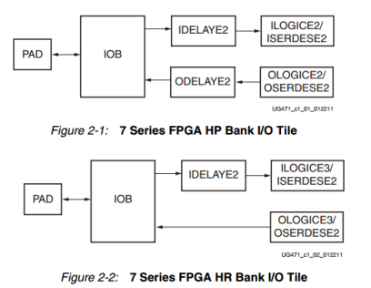

## IOB
IOB本身是非常重要的资源 需要话很多时间看ug471 
和外界交互的器件 但不仅仅是引脚 在xilinx中分为HP 1.8V 高性能接口 高速 HR 3.3v 高动态 广泛的电平标准
HR管脚没有ODEdelay block

ologic 也不同 缺了一个模块
-  1.电器特性: 
    电平标准 
    vcco参考电压
    单端:lvcmos lvttl hstl pci sstl
    双端:lvds mini_lvds,rsds.ppds,bvds
    SLWE设置:slow fast
    上下拉设置 pullup down keeper
    差分匹配电阻 100Ω
-  2.内部逻辑功能和资源 
    ILOGIC: 捕捉数据的单元
   - 边沿的DFF输入
   - IDDR数据输入模式 : 支持双边缘的数据 双边缘的采集 通过内部反相器同时采集数据
    原同步时钟 上游系统提供时钟线加数据 此时就要观察跳变沿 自同步
   - 电平敏感的数据输入模式
   - 异步或者组合逻辑输入路径
    IBUF:输入缓冲,原语自动会生成
    IDELAY:实现31个延迟
    OLOGIC: 可以配置成单边沿 双边沿 锁存器 异步或者组合输出
        ODDR
  

-  3.特殊功能模块  ISERDES2 OSERDES2 IN_FIFO OUT_FIFO
OSERDES ISERDES 串并转换器 单个能实现1to8 
IN_FIFO OUT_FIFO: 可以实现十二个拍延迟 在逻辑单元也有

## CLB 最小运算单元 configurable logic block
ug474 ug953
熟悉架构
熟悉slice结构
熟悉基本单元 LUT FF 控制信号
