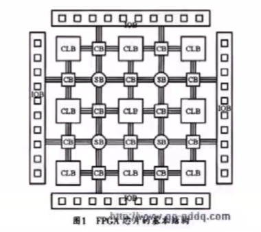
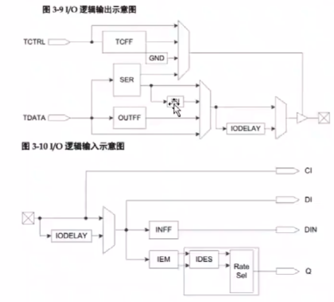

代码本身的schematic，数字电路的逻辑
在综合后产生schematic， 最终映射到fpga内形成版图
在网表内可以点击查看版图对应的部分
fpga的结构
- FB function block --LUTs + FF
- 输入输出IO
- 片内的布线资源 routing network（switch box）

什么是lut  look up table
就是一个穷举出来的所有结果

IOB 功能相近的放在一个bank

可以通过ser和delay实现串并转换，有一个控制信号可以进行控制
输入：iem ides串并转换 移位寄存器 
代码写好之后会自动配置成某一种模式

布线资源
- 全局布线资源 内部全局时钟 复位 置位。 高扇出的信号 保证低延时
- 长线资源 bank之间的高速信号 第二全局时钟信号
- 短线资源 基本逻辑单元的互联 

### 选型

IOB 管脚够不够
CLB 规模够不够 按经验 
DSP 
BRAM 存储资源 信号处理把数据存起来
PLL 时钟 分频精度 决定板子晶振 
DDR3 内部的资源不够了支不支持
Serdes 高速串行接口 
ARM 要不要跑软核 xilinx文档比较好
FAE 
DOC
Price
