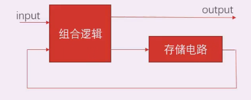
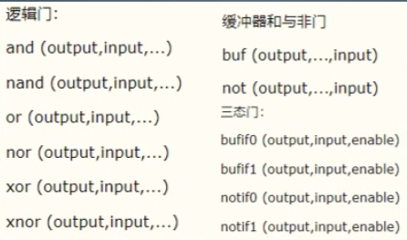

- 时序逻辑的理论模型 *数字电路 康华光 华科*
组合电路 与时间无关 
 i.e. 加法器 编码器 译码器 选择器
 存储电路 i.e. 双稳态电路
 在没有外来触发信号时候稳定 在外加输入和出发共同作用下翻转
时序电路
i.e. 计数器
 时序逻辑电路由组合电路和存储电路 加反馈组成
 状态与时间因素相关
 时序电路是状态依赖的又称状态机
 分为同步/异步 fpga是同步时序电路 以clk为依赖



- 从代码和RTL映射看时序逻辑和组合逻辑
组合电路消耗LUTS
时序电路 LUTS+DFF

- 从仿真看两种电路
五种仿真的区别  
behavior simulation 验证RTL功能是否正确
Post syn timing 综合后的仿真 考虑了器件的延时 还没布局布线
Post syn functional 所有逻辑的映射到硬件资源 生成网表 此时会自动优化 看优化的情况
Post implement timing完成布局布线
Post implement functional 综合考虑器件和布局布线的延时 充分验证优化后的真实情况

示例 实现一位全加器
 设计逻辑
 - 明确输入输出接口
 - 全加器真值表
 - 逻辑表达式 
 - verilog语法实现
 - 不同方法的RTL级区别

1. 输入输出分析


2. 列真值表, 

   
3. 写出与或表达式

利用同或异或进行化简
这里需要学数电, 简化后的电路资源使用较少

直接使用原始表达式也ok, 使用资源多
异或门也可以使用三输入的接口
注意and 等操作 类似汇编 把结果放在第一个参数, u代表元器件
 ```verilog
wire AB; //result A and B
wire ABCin; //result Cin and A_B
wire A_B;//result A xor B

and u1(AB,A,B);
xor u2(A_B,A,B);
 ```

门级建模形式: 逻辑门 缓冲器 与非门 三态门


关于testbench书写 add simulation source
在initial里写出真值表的所有情况 
$monitor可以打印 
最后对测试模块进行例化 两种写法 可以加. 可以不加

仿真的话使用 do 文件仿真速度比较块 使用modelsim

不同的写法 对应了 不同的综合结果 
如使用加法器的进位 综合出来的结果不含有与或门
使用case写成三位转两位的查找表 综合结果为RTL_ROM
