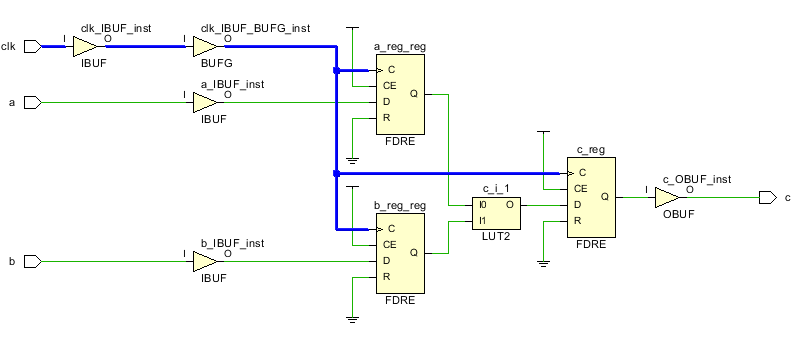
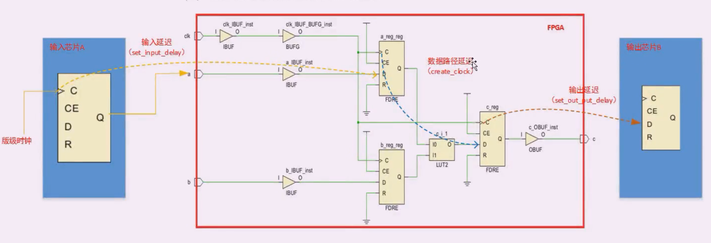

## 时序约束的意义是? 
硬件电路的设计-代码编码-rtl分析到数字电路-synthesis翻译成fpga底层电路-implementation布局布线
物理约束:管脚对应
时序约束:跑在多高的主频. 布局布线的时候以满足时序的要求
如两信号相加的电路中 其传输的路径为

时钟电路作为高扇出信号 其到达每个寄存器的时间基本相同
同步电路的要求 总的走线走完要在一个clk以内

Tco 寄存器clk来了到数据出现在输出端的延迟 , 由器件的工艺决定
Tlogic 组合逻辑处理时间 lut的延迟 由程序决定
Trouting 布线延迟 EDA工具决定
Tskew 时钟到达两个寄存器的时间差 由芯片决定

Tsu 建立时间 触发器时钟上升沿来到之前数据稳定的时间 最小稳定时间
    数据要在时钟来之前早一点点到达， 才能被采集到
Thold保持使劲按 触发器上升沿来到后 数据稳定不变的时间 最小保持时间
    数据到了还要维持一段时间 

两者均要足够长才能保证数据的写入

Tclk>=Tco+Tlogic+Trouting+Tsu-Tskew  只能改变Tlogic routing也是EDA决定的

### 这些时间分别有多长？
    DS191 文档 table66 与速度等级有关 

所有上边的参数最后给出的时序报告会给出
时间域量: setup slack = Data Required time- Data Arrival time
时间域量满足的情况下可以加延时

## 时序约束约哪里?
分四类
 -  输入端口第一级触发器 set_import_delay  告诉外部芯片进来的延迟有多大
 -  内部寄存器的布线 create_clock **用的最多**
 -  末级触发器到输出 set_output_time_delay 告诉外部芯片输出的延迟有多大
 -  输入到输出的routing  set_max_delay

