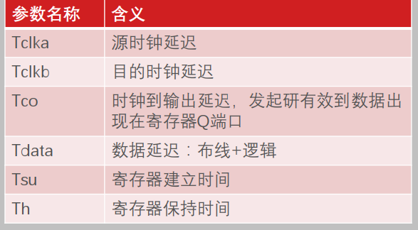

## 读懂时序报告
建立时间和保持时间 对于边沿敏感型器件的需求
同步系统给tclk有一个要求:数据的发起和捕获之间小于一个时钟周期
建立时间不够的原因 : 组合逻辑处理时间太长 时钟信号偏慢
保持时间不足: 跨时钟域设计, 由于主频不一致; 数据源端寄存器输出后,直接与下一个寄存器相连, 很小概率 当Tco比Th小的时候

### 处理方法
建立时间不够 拆分大的组合逻辑 技巧
保持时间不满足: 跨时钟域cdc问题 异步同步设计; 同时钟 插入冗余组合逻辑

## 综合的时序报告了什么?
eda如何完成时序的分析?
**通过三条路径** 源时钟路径 数据路径 目标时钟路径

数据实际到达时间
Data Arrival time = Launch edge+Tclka+Tco+Tdata
以发起时间参考 launch edga=0
目的寄存器时钟到达时间
Clock Arrival time = Capture edge + Tclkb
捕获时间capture edge= launch edge + 1clk

建立时间
data required time (setup) = Clock Arrival time - Tsu -Clock Uncertainty
保持时间
data required time (hold)=Clock Arrival time + Th - Clock Uncertainty

clock uncertainty 是eda给出的 

## 综合工具时序报告
前面需要做一些准备
implementation-report time summary
    这里做input和output的delay
    intra-clock inter-clock做跨时钟同步异步
intraclock paths 里面有时序路径的分析报告
slack 裕量 为正满足要求
source 起点 终点 时钟组
path type 建立时间/保持时间 
requirement 时钟要求
data path delay : Tdada
logic level: 逻辑深度
Tskew 一般给0 没有时钟偏斜
clock uncertainty 仿真工具的抖动模型

### 三条路径分析报告
打开版图 左上角查看连线 选中clk path中的对应路径 可以查看连线
