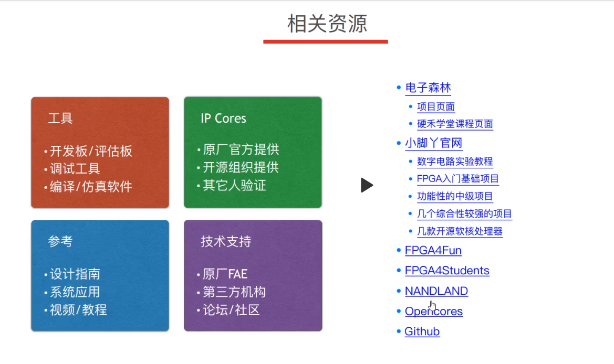

## 资料
https://www.eetree.cn/project/detail/251
上一次的项目 官方的adc和dds

21年电赛的综合
https://www.eetree.cn/project/detail/248
里边有信号发生器的案例

示波器
https://www.eetree.cn/project/detail/35

DDS wiki 在项目信息页 小脚丫 stepfpge

https://www.eetree.cn/doc/detail/2570
项目综合学习资源

核心板介绍
https://www.eetree.cn/project/detail/7

## 项目
项目3 - DDS任意波形发生器/本地控制
具体要求：

通过板上的高速DAC（10bits/最高125Msps）配合FPGA内部DDS的逻辑（最高48Msps），生成波形可调（正弦波、三角波、方波）、频率可调（DC-）、幅度可调的波形
生成模拟信号的频率范围为DC-5MHz，调节精度为1Hz
生成模拟信号的幅度为最大1Vpp，调节范围为0.1V-1V
在OLED上显示当前波形的形状、波形的频率以及幅度
利用板上旋转编码器和按键能够对波形进行切换、进行参数调节

项目2 - 单通道示波器/PC页面显示
具体要求：

通过板上高速ADC采集模拟信号，将采集到的数据通过串口发送到PC上，通过PC上的界面进行显示
被采集信号的频率范围为DC - 1MHz
PC上的界面显示可以使用Matlab、LabView或开源的串口调试工具
如没有外接信号源，可以通过板上的高速DAC产生任意波形或通过GPIO产生频率可调、占空比可调的PWM波形作为测试信号
按键/旋转编码器可以控制波形的时间和幅度的缩放，按键的功能可以自行定义

项目6 - RISC-V软核的设计或移植
设计或移植一款RISC-V软核（网上有很多）
能够用流水灯的方式点亮核心板上的LED

--但是板载有一个32

选择 1994-2021 国赛题目任选一题
旋转编码器控制设置参数 oled屏幕显示参数打dds信号发生器和采集系统

## 备赛
入门fpga 2周 课程的免费观看 老师
针对性训练 参考代码 1月
准备模块 代码案例 1月

根据不同的性能 换模块 

## 环境配置
1. stm32G031 完成示波器部分/直播课程/参考项目
下载程序 通过stm32cubemx  通过keil开发
按住按键进入下载模式 使用cubeprogrammer下载

2. fpga wiki页面的项目全做一遍

lattice radiant
申请license 
注意下载模式, 由于是虚拟优盘下载, 需要在project-active strategy-bitstream 内选 rbt格式

3. 调试 
使用adalm2000 + scopy

## stm32部分 
示波器
mcu链接的是屏幕 按键 和旋转编码器 通过上班部分完成示波器的代码,实现按键和屏幕的控制

## fpga
- 由于dac和adc都和fpga链接, 先进行fpga的编程,得到示波器需要的数据
- 数据发生 dds的程序

## mcu-fpga通信 
通过fpga端编写spi进行通信,将按键的信号发送到fpga

- spi建立通讯
- 数据传输
  
后续如何传输数据
- 采集到数据再传输到mcu
- 接受mcu命令再去采集

这个架构可以解决，mcu本身做采集的时候内部的adc速度不够快，或者节省成本，或者加强他的可扩展性。

其实单片机本身也可以做所有的mcu的工作，但是分开后更加的合理。
- fpga高速
- mcu低速，但是有图形和按钮控制的库

## dac和adc的源码
