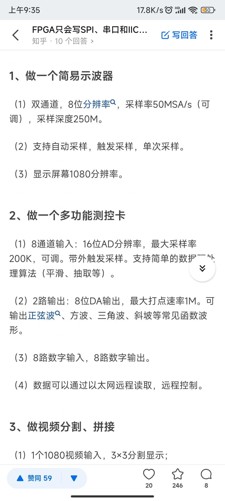
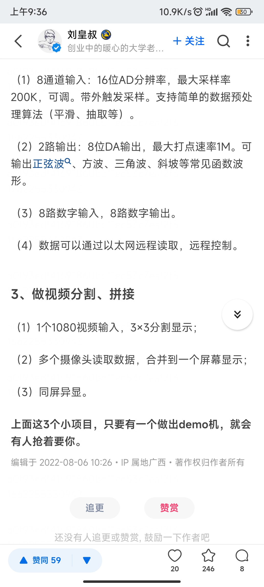

# 入门知识
系列课程来自myminieye，并且带有课件
还有一门信号处理的课 讨论了矩阵转置等问题
## 1. 硬件基础
- 硬件架构与原理
  - 基本结构
  - 逻辑资源slice
  - 芯片选型与规模评估
  - 示例：分析xlinx和国产的结构
- 基础逻辑单元clb
  - clb是什么
  - 进位链功能
  - slice M， slice L的功能
  - 分布式RAM和分布式ROM RTL图
- 可编程IO资源
  - 什么是可编程IO
  - 输入输出寄存器
  - delay
## 2. HDL基础
- fpga原厂不会告诉的秘密
  - 一些有趣的调研
  - 在编码的同时就找到并修复问题
  - fpga厂家流程中的脆弱的验证环节
  - Blue Pearl环境
- fpga验证流程 Blue Pearl
  - CDC问题的来源
  - CDC问题的种类与解决方案
  - Blue Pearl的CDC解决方案
  - Blue Pearl的完整验证功能介绍
## 3. 入门基础篇
- 开发工具 vivado+vitis+modelsim
- 高效查找fpga开发资料
- fpga编辑工具 Blue Pearl
- 怎样开始一个fpga工程
- verilog语法基础
- 状态机的三种写法
  - 介绍 
  - 综合工具对三种状态机的综合分析 
  TODO:写状态机
  - Blue Pearl的调试
- 组合逻辑 时序逻辑
  - 分别仿真
  - RTL分析
- fpga数字逻辑电路的设计与分析
  - 通过全加器分析RTL与综合工具
## 4. 仿真基础篇
- 编写tb文件
  - 流程、方法
- vivado联合仿真与do文件的编写
  - 编译库文件
  - 调用联合仿真
  - 建议do文件的处理
- modelsim的使用
  - 创建工程并仿真
  - 使用技巧
## 5. 时序分析
- 静态时序分析理论基础：数据传输模型
  - 时序约束的意义
  - xilinx时序报告
- 基于vivado的时序分析
  - 综合时序报告
  - 时序分析实例解

 使用vscode开发 
 vscode+iverilog+gtkwave
 看这一篇 [用VSCode编辑verilog代码、iverilog编译、自动例化、自动补全、自动格式化等常用插件 - 浮沉野马的文章 - 知乎](
https://zhuanlan.zhihu.com/p/338497672)
用知乎搜vscode verilog

公众号 FPGA开源工作室
[fpga图像处理入门视频课程](https://mp.weixin.qq.com/s/nHuMs8nyalRYxLrFPy2mEA)
芯王国
同样有一些开源项目
知乎专栏 [OpenIC特别兴趣小组](https://www.zhihu.com/column/c_1029044037684183040)
[片上征途](https://www.zhihu.com/column/conquest-on-chip)
数字设计 
TODO:b站王红课程 岩石的书以及课后习题
Digital Design and Computer Architecture, Second Edition

fpga除了看课程之外 夏雨闻的书 原理与结构这一本方便理解
设计实战演练 使用quartus进行讲解 大量示例

[codeleading 代码先锋网](https://www.codeleading.com/article/30332075779/)